# Guía de contribución

> **Note**
> Este documento está escrito en español (this document is written in Spanish)

Muchas gracias por el interés en este repositorio el cual corresponde a mi sitio web personal, estoy abierto a contribuciones las cuales están sujetas al siguiente proceso:

## Análisis

Para el análisis de las tareas a desarrollar se usaran issues y discussions, los cuales deben estar detallados y para ello se facilitan una serie de plantillas que ayudan con su creación

Para los issues resalto 2 categorías que implican cambios en el código, y las preguntas considero que es mejor tratarlas como discussions

### Issues

Puedes crear nuevos incidentes (issues) usando el botón "New issue" en la pestaña "Issues" del repositorio

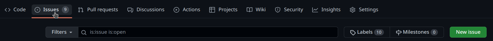

Reporte de error: En esta categoría se enumeran todos los comportamientos inesperados (o defectos), ya sean visuales o bien algún error que aparezca en la consola del navegador

Solicitud mejora: Estos se darán cuando haya algo que se pueda mejorar en el sitio web, ya sea que se pueda adicionar una nueva funcionalidad o bien cambiar el comportamiento de alguna existente.

Selecciona una de las plantillas según el tipo de incidente que deseas reportar presionando el respectivo botón "Get started"

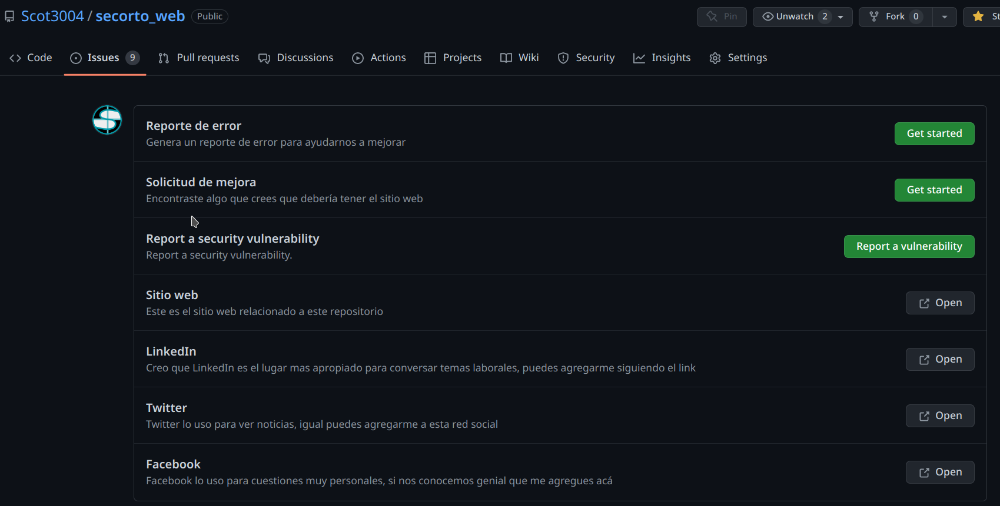

Reemplaza el contenido de acuerdo a lo que quieres reportar para lo cual aparecerá un formulario con la información a diligenciar

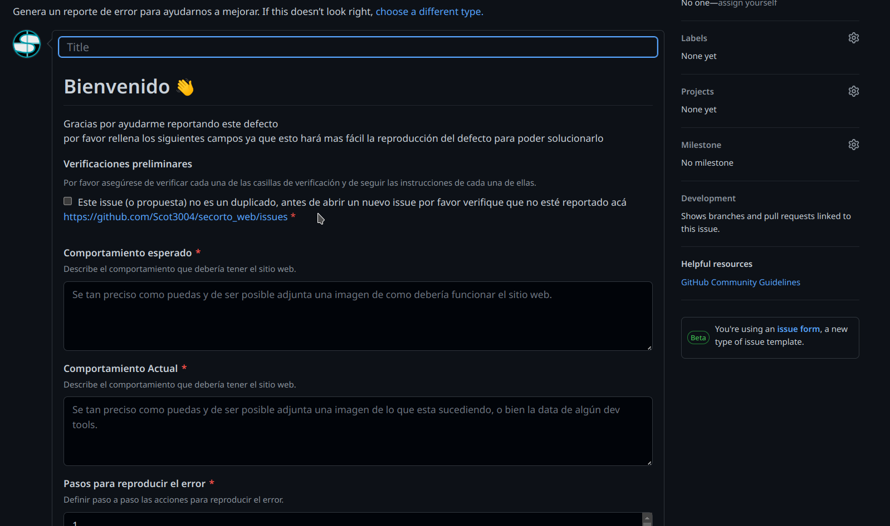

### Discussions

Esta funcionalidad permite tener un foro en el repositorio donde se pueden discutir funcionalidades, de hecho surge como una mejora al tipo issue que ya tenia github

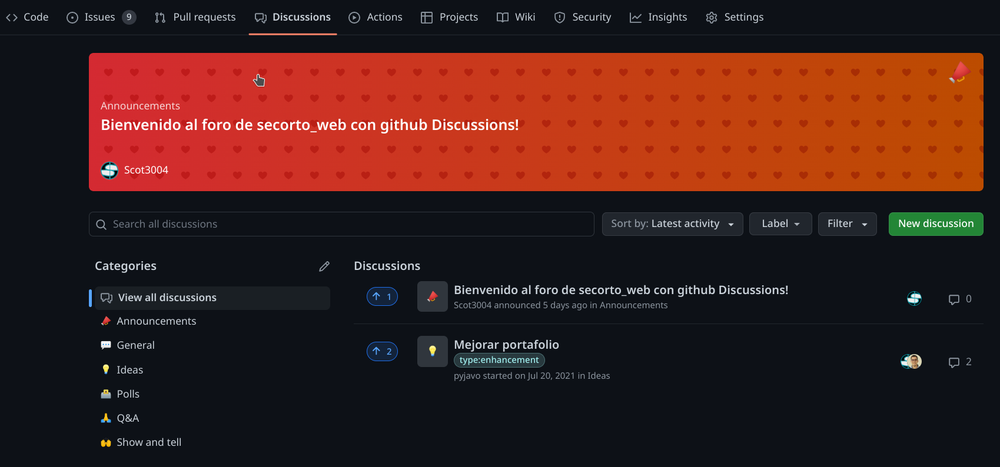

## Desarrollo

Para el desarrollo de cualquiera de las tareas creadas (issues) recomiendo hacer la instalación de node usando la misma versión que veas en el archivo [.nvmrc](.nvmrc) e instala [yarn](https://yarnpkg.com/) el puedes habilitarlo en las versiones mas recientes usando el comando `corepack enable`

### 🧐 Como está organizado este proyecto?

Esta es una vista rápida del primer nivel de directorio que veras en este proyecto

```console output
    ├── content
    ├── src
    ├── node_modules
    ├── .gitignore
    ├── .prettierrc
    ├── gatsby-browser.js
    ├── gatsby-config.js
    ├── gatsby-node.js
    ├── gatsby-ssr.js
    ├── LICENSE
    ├── package-lock.json
    ├── package.json
    └── README.md
```

1. **`/content`**: En este directorio están almacenados los contenidos de mi página web

2. **`/src`**: En este directorio está el código fuente del proyecto, entre ellas las paginas (src/pages) y todos los componentes usados de forma auxiliar

3. **`/cypress`**: Este directorio contiene los test e2e desarrollados usando cypress

4. **`.gitignore`**: Este archivo especifica los archivos y directorios que no se deben cargar en git

5. **`.prettierrc`**: Este es el archivo de configuración de prettier [Prettier](https://prettier.io/).

6. **`gatsby-browser.js`**: Este archivo especifica como gatsby se comportara en el navegador, puedes leer el articulo [Gatsby browser APIs](https://www.gatsbyjs.com/docs/browser-apis/) para mas detalles al respecto.

7. **`gatsby-config.js`**: Este es el archivo de configuración donde se almacenan los datos sobre el sitio (meta-datos), adicionalmente la configuración de plugins, para mas información lee la [Documentación de este archivo](https://www.gatsbyjs.com/docs/gatsby-config/) for more detail).

8. **`gatsby-node.js`**: En este archivo se agregan las personalizaciones del proceso de construcción del sitio, puedes leer la documentación sobre [Gatsby Node APIs](https://www.gatsbyjs.com/docs/node-apis/) para mas detalles al respecto.

9. **`gatsby-ssr.js`**: En este archivo se espera encontrar las configuraciones de [Gatsby server-side rendering APIs](https://www.gatsbyjs.com/docs/ssr-apis/).

10. **`LICENSE`**: Aca encuentras los términos de licencia del código que estás viendo

11. **`package.json`**: Es un manifiesto para los proyectos hechos con Node.js, que incluye cosas como los meta-datos (como el nombre del proyecto, autor, etc) con este archivo es que node sabe que paquetes instalar.

12. **`yarn.lock`** Este es un archivo auto-generado por yarn que incluye las versiones exactas de los paquetes npm. **(Este archivo no deberías modificarlo manualmente).**

13. **`/node_modules`**: Este directorio contiene todos los módulos de los que tu proyecto depende (paquetes npm) y son automáticamente instalados.

14. **`README.md`**: Este, el archivo que estás leyendo pose información relevante sobre como se configura, como se corre y demás, todo proyecto git debería tener uno bien documentado

### Instalación

Para instalar las dependencia de este proyecto, por favor ejecuta el comando

```bash
yarn install
```

### Ejecutar server para desarrollo

Una instaladas todas las dependencias podemos ejecutar  el comando

```bash
yarn develop
```

El cual nos iniciara un servidor de desarrollo donde podemos ir viendo como afectan al sitio web los cambios que estamos haciendo y por defecto se ejecutará en [http://localhost:8000](http://localhost:8000)!

> Nota
> Para verificar las queries [graphql](https://graphql.org/) ingresa a
[http://localhost:8000/___graphql](http://localhost:8000/___graphql)

### Actualizar browser list

En algunos casos puede se muestre una advertencia acerca de que los scripts se ejecutan apuntando a una versión vieja de los navegadores y debemos refrescarla usando el comando

```bash
npx browserslist@latest --update-db
```

## Pruebas

Las pruebas son parte clave de cualquier proceso de desarrollo, en lo personal soy muy apasionado por este tema y considero que ayudan a poder dormir tranquilo sabiendo que hicimos un trabajo bien hecho.

puedes ejecutar todas las pruebas que están en este proyecto usando el comando

```bash
yarn test
```

### Pruebas unitarias

Estas pruebas son de rápida ejecución y mi recomendación para cualquier proyecto es tener una buena cobertura de estas, en este proyecto en particular decidí usar [jest](https://jestjs.io/)

puedes ejecutar las pruebas unitarias ejecutando el comando

```bash
yarn test:unit
```

### Pruebas e2e

Estas pruebas dan un feedback de la aplicación real aunque son lentas y tediosas de mantener considero que el valor que aporta se da para querer tener unas pocas de estas muy bien enfocadas, para este proyecto en particular decidí usar [cypress](https://www.cypress.io/)

Para ejecutar estas pruebas se requiere ejecutar la aplicación para lo cual están los siguientes comandos

```bash
# Ejecución las pruebas
yarn cy:run

# Ejecución del front de cypress, cuando la aplicación está corriendo
yarn cy:open

# Ejecución de la aplicación y las pruebas recomendadas en ci
yarn test:e2e:ci

# Ejecución para el desarrollo de las pruebas (y la aplicación no este en ejecución)
yarn test:e2e
```

## Pull Requests

Por favor mantén tus pull requests enfocados en un solo tema en específico.
Si tienes un número de solicitudes por enviar, entonces envía solicitudes
separadas. Es mucho más fácil recibir solicitudes pequeñas y bien definidas, que
tener que revisar y gestionar solicitudes grandes que apuntan a diferentes
temas.

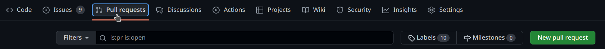

Una vez le des crear selecciona la rama base, que para este repositorio es `master` y luego debes seleccionar la rama desde la cual hiciste tus cambios

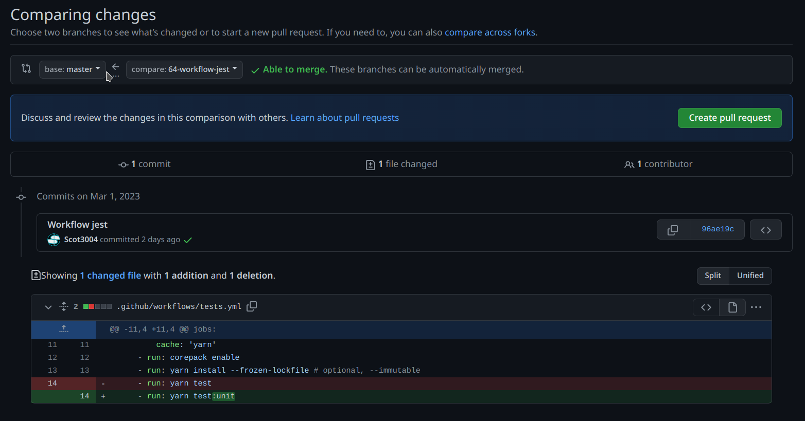

Una vez tengas seleccionadas las ramas deberás colocar una descripción a tu pull request, para lo cual aprovecha la plantilla que aparece por defecto

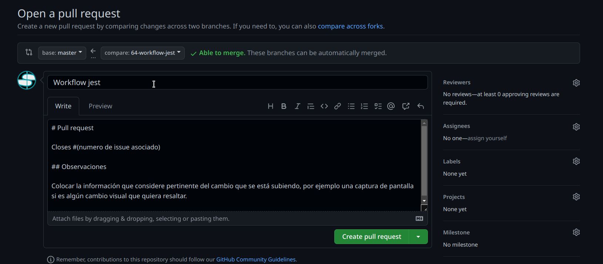

Reemplaza el numero de issue asociado y agrega unas observaciones, sugiero colocar acá unas capturas que resalten el cambio que has generado

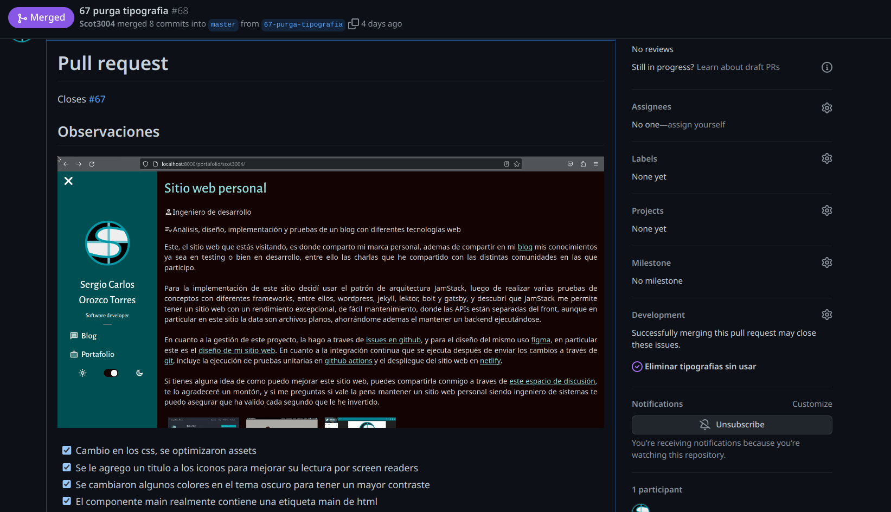

### Verificaciones

Para aprobar un pull request, me baso en 2 criterios

1. El cambio está justificado a traves de un issue. que justifique su valor.
2. Se están siguiendo buenas practicas de desarrollo
3. Todas las verificaciones pasan en verde
4. Luego de una verificación manual veo que no se rompió nada (regresión)

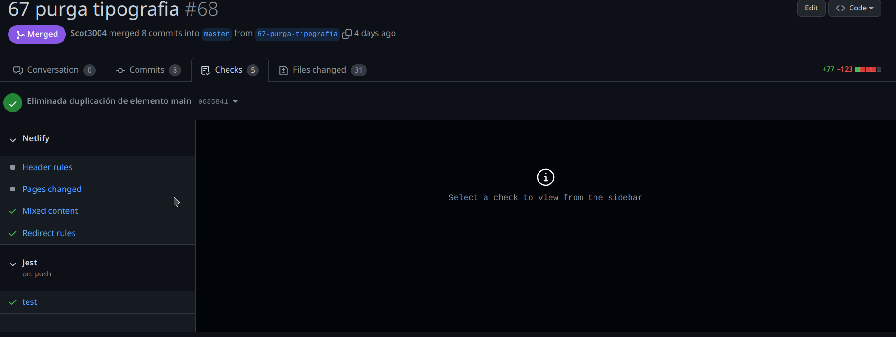

En este repositorio se usan verificaciones automatizadas usando [github actions](https://github.com/features/actions) y [netlify](https://www.netlify.com/)

Las cuales se ven asi:

Panel de administración de netlify
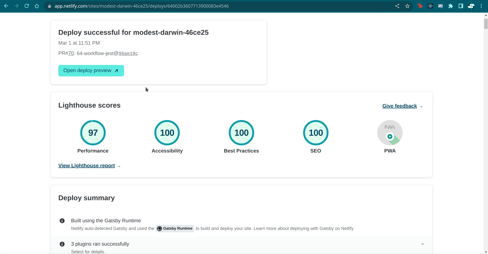

Github action
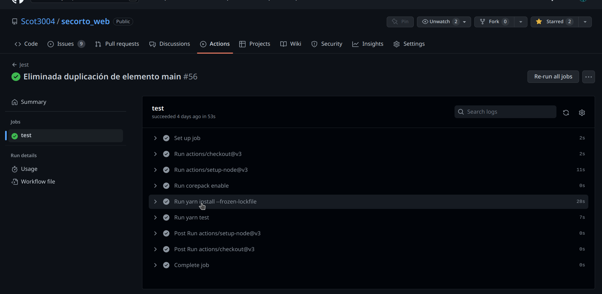
